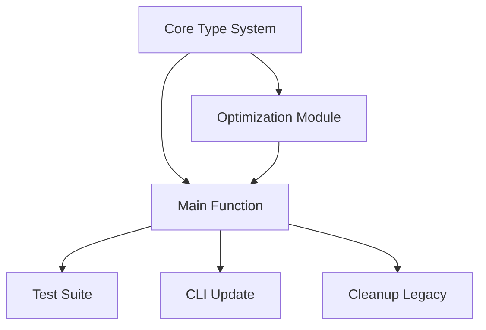

# computeMaxDistance Refactor - Implementation Plan

## Executive Summary

This plan outlines a comprehensive refactor of the `computeMaxDistance` function to return a structured result with distance, tilt angle, line count, and focal length. The implementation will introduce new classes for `Angle` and `Zoom` to provide better abstractions and type safety. All backward compatibility will be removed, and the codebase will be cleaned of legacy code.

## Requirements Clarification

### Original Request
- Return a structure with distance in meters, tilt angle, total number of lines, and focal length
- Errors should throw
- Additional improvements to computeMaxDistance

### Clarified Requirements
1. **Function rename**: Change from `computeMaxDistance` to a more descriptive name reflecting the enhanced return type
2. **Return structure**: Create an interface with:
   - `distanceInMeters`: Maximum distance (current functionality)
   - `tiltAngle`: Angle instance with degrees/radians properties
   - `lineCount`: Total number of lines within the computed distance
   - `focalLength`: Focal length in millimeters
3. **New abstractions**:
   - `Angle` class with cached degree/radian conversions
   - `Zoom` class with zoom level and focal length as cached property
4. **Error handling**: Throw specific error classes for impossible constraints
5. **No backward compatibility**: Clean all unused/legacy code
6. **Testing**: Update all tests with 80% coverage threshold maintained
7. **CLI update**: Display all returned information

### Assumptions Made
- Line count means the total number of visible lines from camera to max distance (maxDistance / LINE_SPACING)
- The tilt angle is the optimal angle computed during distance optimization
- Angle class should handle conversion between degrees and radians efficiently
- Zoom class encapsulates the zoom-to-focal-length relationship
- Error cases that currently return 0 or 2 should be evaluated for whether they're errors

## Technical Specification

### Architecture Overview

```
src/
├── types/
│   ├── angle.ts          # New Angle class
│   ├── zoom.ts           # New Zoom class
│   └── assessment.ts     # Updated result interfaces
├── errors/
│   └── camera-errors.ts  # Specific error classes
├── core/
│   └── optimization.ts   # Updated optimization logic
├── analyze-camera-view.ts # Renamed main function
└── index.ts              # Updated exports
```

### Detailed Design

#### 1. Angle Class
```typescript
export class Angle {
  private readonly _radians: number;
  private _degrees?: number;
  
  constructor(radians: number) {
    this._radians = radians;
  }
  
  static fromDegrees(degrees: number): Angle {
    return new Angle(degrees * Math.PI / 180);
  }
  
  get radians(): number {
    return this._radians;
  }
  
  get degrees(): number {
    if (this._degrees === undefined) {
      this._degrees = this._radians * 180 / Math.PI;
    }
    return this._degrees;
  }
}
```

#### 2. Zoom Class
```typescript
export class Zoom {
  readonly level: number;
  private _focalLength?: number;
  
  constructor(level: number) {
    if (level < 1 || level > 25) {
      throw new InvalidZoomLevelError(level);
    }
    this.level = level;
  }
  
  get focalLength(): number {
    if (this._focalLength === undefined) {
      this._focalLength = computeFocalLength(this.level);
    }
    return this._focalLength;
  }
}
```

#### 3. CameraViewAnalysis Interface
```typescript
export interface CameraViewAnalysis {
  distanceInMeters: number;
  tiltAngle: Angle;
  lineCount: number;
  focalLength: number;
}
```

#### 4. Error Classes
```typescript
export class CameraAssessmentError extends Error {
  constructor(message: string, public code: string) {
    super(message);
    this.name = 'CameraAssessmentError';
  }
}

export class ImpossibleConstraintError extends CameraAssessmentError {
  constructor(minPixelGap: number, sensorHeight: number) {
    super(
      `Impossible constraint: minPixelGap (${minPixelGap}) exceeds sensor height (${sensorHeight})`,
      'IMPOSSIBLE_CONSTRAINT'
    );
  }
}

export class InvalidZoomLevelError extends CameraAssessmentError {
  constructor(zoomLevel: number) {
    super(
      `Invalid zoom level: ${zoomLevel}. Must be between 1 and 25`,
      'INVALID_ZOOM'
    );
  }
}
```

### Integration Points
- Replace all `getFocalLength()` calls with `Zoom` class usage
- Update optimization module to return angle information
- Modify CLI to format and display the structured result
- Update all imports/exports in index.ts

## Implementation Strategy

### Parallel Task Breakdown

#### Task 1: Core Type System (Agent 1)
- Create Angle class with tests
- Create Zoom class with tests
- Create error classes with tests
- Define CameraViewAnalysis interface
- Estimated time: 30 minutes

#### Task 2: Optimization Module Refactor (Agent 2)
- Update optimization functions to return angle data
- Modify internal structures to support new return type
- Update computation logic to track line count
- Estimated time: 45 minutes

#### Task 3: Main Function Refactor (Agent 3)
- Rename computeMaxDistance to analyzeCameraView
- Integrate new type system
- Implement error throwing logic
- Return structured result
- Estimated time: 30 minutes

#### Task 4: Test Suite Update (Agent 4)
- Update existing tests for new function name
- Add tests for Angle class
- Add tests for Zoom class
- Add tests for error conditions
- Add tests for new return fields
- Estimated time: 60 minutes

#### Task 5: CLI Update (Agent 5)
- Update command name and description
- Format output to display all fields
- Add color coding for better readability
- Update help text
- Estimated time: 20 minutes

#### Task 6: Cleanup Legacy Code (Agent 6)
- Remove old computeMaxDistance function
- Remove getFocalLength utility
- Clean up unused imports
- Update all references
- Estimated time: 20 minutes

### Task Dependencies


### Synchronization Points
1. After Task 1 completes - all agents can use new types
2. After Tasks 2 & 3 complete - testing can begin
3. After all tasks complete - final validation

## Testing Strategy

### Test Scenarios

#### Angle Class Tests
- Construction from radians
- Construction from degrees
- Conversion accuracy
- Caching behavior
- Edge cases (0, π, 2π, negative values)

#### Zoom Class Tests
- Valid zoom levels (1-25)
- Invalid zoom levels (0, 26, negative)
- Focal length calculation
- Caching behavior

#### analyzeCameraView Tests
- All existing test scenarios adapted
- Error throwing for impossible constraints
- Correct line count calculation
- Angle value verification
- Focal length consistency
- Integration with new type system

#### CLI Tests
- Output formatting
- Error display
- Help text accuracy

### Coverage Requirements
- Maintain 80% global coverage
- 100% coverage for new type classes
- 100% coverage for error classes
- Focus on branch coverage for error paths

## Validation Criteria

### Success Metrics
1. All tests pass with ≥80% coverage
2. TypeScript compilation succeeds with no errors
3. ESLint and Prettier checks pass
4. CLI displays all information correctly
5. No backward compatibility code remains

### Acceptance Tests
1. `pnpm run validate` passes completely
2. CLI command works with new output format
3. Error cases throw appropriate exceptions
4. Performance remains under 10ms
5. All imports/exports updated correctly

## Risk Analysis

### Potential Issues
1. **Breaking changes**: Consumers of the library will need updates
2. **Performance impact**: New abstractions might add overhead
3. **Test complexity**: Refactoring tests while maintaining coverage
4. **Integration conflicts**: Multiple agents modifying related files

### Mitigation Strategies
1. **Breaking changes**: Document migration guide in changelog
2. **Performance**: Benchmark before/after, optimize if needed
3. **Test complexity**: Run tests continuously during refactor
4. **Integration**: Clear task boundaries, frequent synchronization

## Timeline Estimate

With 6 parallel agents:
- Initial setup: 5 minutes
- Parallel execution: ~60 minutes (longest path)
- Integration & validation: 15 minutes
- Total estimated time: ~80 minutes

Sequential execution would take approximately 3.5 hours, demonstrating the efficiency of the parallel approach.

## Migration Guide

For users of the library:

### Before
```typescript
const distance = computeMaxDistance(zoomLevel, minPixelGap);
```

### After
```typescript
const analysis = analyzeCameraView(new Zoom(zoomLevel), minPixelGap);
const distance = analysis.distanceInMeters;
const tiltDegrees = analysis.tiltAngle.degrees;
const lineCount = analysis.lineCount;
const focalLength = analysis.focalLength;
```

## Next Steps

1. Review and approve this plan
2. Launch 6 parallel agents with their assigned tasks
3. Monitor progress at synchronization points
4. Perform final integration and validation
5. Update documentation and changelog