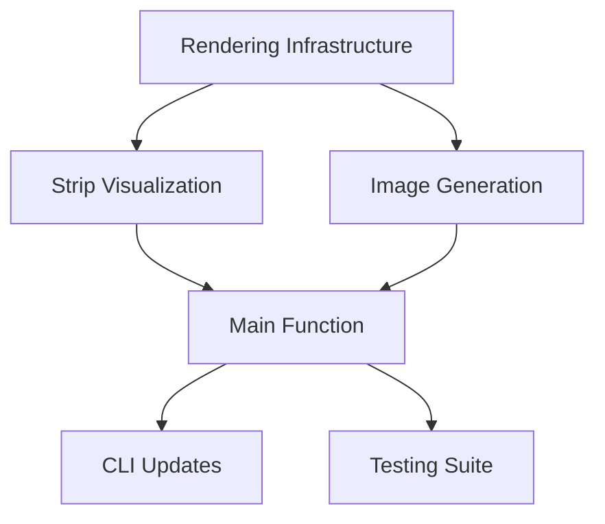

# generateStripDemoImage - Implementation Plan

## Executive Summary

This plan outlines the implementation of a new `generateStripDemoImage` function that creates visual overlays showing ground strips as they would appear through the camera. The function will integrate with the refactored `analyzeCameraView` API and reuse existing projection logic to ensure consistency with the analysis calculations. The output will be an overlay image suitable for placement over real camera footage.

## Requirements Clarification

### Original Request
- Add a function to generate a demo image showing ground strips from the camera's perspective
- Reuse existing computeMaxDistance logic (now analyzeCameraView)
- Create overlay images that align with real camera views
- Support both transparent and opaque backgrounds

### Clarified Requirements
1. **Integration with refactored API**: Use `analyzeCameraView` and new type abstractions
2. **Graphics library**: Use `sharp` for image generation
3. **Visual specifications**:
   - Background: Black (default) or transparent (via flag)
   - Strip lines: 2-pixel thick solid horizontal lines in vivid colors
   - Full image width for all lines
   - Highlight furthest two strips (N-1 and N)
   - Annotate pixel gap between them
4. **Projection accuracy**: Lines must align exactly with real-world positions
5. **CLI integration**: Add as optional parameters to existing command
6. **Code reuse**: Leverage existing projection functions, no business logic duplication

### Assumptions Made
- Image dimensions match sensor resolution (2560x1440)
- Pinhole camera model (no lens distortion)
- Lines are red (#FF0000) on black background, green (#00FF00) on transparent
- Text annotation is white with black outline for visibility
- Output format is PNG (supports transparency)

## Technical Specification

### Architecture Overview

```
src/
├── rendering/
│   ├── strip-renderer.ts    # Main rendering logic
│   └── image-generator.ts   # Sharp-based image generation
├── types/
│   └── rendering.ts         # Rendering-specific types
├── cli/
│   └── commands.ts          # Updated CLI command
└── index.ts                 # Updated exports
```

### Detailed Design

#### 1. Rendering Types
```typescript
export interface StripRenderOptions {
  analysis: CameraViewAnalysis;
  transparentBackground?: boolean;
  outputPath: string;
}

export interface StripVisualization {
  position: number;      // Y pixel coordinate
  distance: number;      // Distance in meters
  isHighlighted: boolean;
}
```

#### 2. Constants Addition
```typescript
// In src/utils/constants.ts
export const STRIP_LINE_THICKNESS = 2; // pixels
export const STRIP_COLOR_OPAQUE = '#FF0000'; // Red for black background
export const STRIP_COLOR_TRANSPARENT = '#00FF00'; // Green for transparent
export const HIGHLIGHT_COLOR = '#FFFF00'; // Yellow for furthest strips
export const TEXT_COLOR = '#FFFFFF'; // White
export const TEXT_OUTLINE_COLOR = '#000000'; // Black
```

#### 3. Main Function
```typescript
export async function generateStripDemoImage(options: {
  zoom: Zoom;
  minPixelGap: number;
  transparentBackground?: boolean;
  outputPath: string;
}): Promise<void> {
  // 1. Get analysis including tilt angle
  const analysis = analyzeCameraView(options.zoom, options.minPixelGap);
  
  // 2. Validate we have visible strips
  if (analysis.lineCount < 1) {
    throw new NoVisibleStripsError(analysis);
  }
  
  // 3. Generate strip visualizations
  const strips = generateStripVisualizations(analysis);
  
  // 4. Render to image
  await renderStripsToImage({
    strips,
    analysis,
    transparentBackground: options.transparentBackground ?? false,
    outputPath: options.outputPath
  });
}
```

#### 4. Strip Visualization Generation
```typescript
function generateStripVisualizations(
  analysis: CameraViewAnalysis
): StripVisualization[] {
  const strips: StripVisualization[] = [];
  const projectionParams = {
    focalLength: analysis.focalLength,
    tiltAngle: analysis.tiltAngle.radians,
    cameraHeight: CAMERA_HEIGHT
  };
  
  for (let i = 0; i < analysis.lineCount; i++) {
    const distance = (i + 1) * LINE_SPACING;
    const pixelPos = projectGroundPoint(distance, projectionParams);
    
    strips.push({
      position: pixelPos.y,
      distance,
      isHighlighted: i >= analysis.lineCount - 2
    });
  }
  
  return strips;
}
```

#### 5. Image Rendering with Sharp
```typescript
async function renderStripsToImage(options: {
  strips: StripVisualization[];
  analysis: CameraViewAnalysis;
  transparentBackground: boolean;
  outputPath: string;
}): Promise<void> {
  const { strips, analysis, transparentBackground, outputPath } = options;
  
  // Create base image
  const image = sharp({
    create: {
      width: SENSOR_RES_X,
      height: SENSOR_RES_Y,
      channels: 4,
      background: transparentBackground 
        ? { r: 0, g: 0, b: 0, alpha: 0 }
        : { r: 0, g: 0, b: 0, alpha: 1 }
    }
  });
  
  // Prepare SVG overlay for lines and text
  const svg = createStripsSVG(strips, transparentBackground);
  
  // Composite SVG onto base image
  await image
    .composite([{ input: Buffer.from(svg), top: 0, left: 0 }])
    .png()
    .toFile(outputPath);
}
```

#### 6. Error Classes
```typescript
export class NoVisibleStripsError extends CameraAssessmentError {
  constructor(analysis: CameraViewAnalysis) {
    super(
      `No visible strips for given parameters. Analysis: ${JSON.stringify(analysis)}`,
      'NO_VISIBLE_STRIPS'
    );
  }
}

export class ImageGenerationError extends CameraAssessmentError {
  constructor(message: string, cause?: Error) {
    super(
      `Failed to generate image: ${message}`,
      'IMAGE_GENERATION_FAILED'
    );
    if (cause) this.cause = cause;
  }
}
```

### Integration Points
- Reuses `projectGroundPoint()` from existing projection module
- Integrates with refactored `analyzeCameraView()` function
- Extends CLI command with new optional parameters
- Adds new export to main index.ts

## Implementation Strategy

### Parallel Task Breakdown

#### Task 1: Rendering Infrastructure (Agent 1)
- Create rendering types and interfaces
- Add new constants for rendering
- Set up sharp dependency and configuration
- Create error classes
- Estimated time: 25 minutes

#### Task 2: Strip Visualization Logic (Agent 2)
- Implement strip position calculation using existing projection
- Create strip visualization data structures
- Handle edge cases for strip visibility
- Estimated time: 30 minutes

#### Task 3: Image Generation (Agent 3)
- Implement sharp-based image creation
- Create SVG generation for lines and text
- Handle transparent vs opaque backgrounds
- Implement pixel gap annotation
- Estimated time: 45 minutes

#### Task 4: Main Function Integration (Agent 4)
- Implement generateStripDemoImage function
- Integrate with analyzeCameraView
- Add proper error handling
- Create usage documentation
- Estimated time: 25 minutes

#### Task 5: CLI Updates (Agent 5)
- Add new command parameters
- Update help text
- Ensure analysis output still works
- Handle file path validation
- Estimated time: 20 minutes

#### Task 6: Testing Suite (Agent 6)
- Unit tests for strip visualization
- Integration tests with analyzeCameraView
- Image generation tests (verify file creation)
- Error condition tests
- CLI parameter tests
- Estimated time: 50 minutes

### Task Dependencies


### Synchronization Points
1. After Task 1 - all agents can use rendering types
2. After Tasks 2 & 3 - main integration can proceed
3. After Task 4 - CLI and testing can begin
4. Final validation after all tasks complete

## Testing Strategy

### Test Scenarios

#### Unit Tests
- Strip position calculation accuracy
- Correct highlighting of furthest strips
- SVG generation correctness
- Error throwing conditions
- Transparent vs opaque background handling

#### Integration Tests
- Full pipeline with analyzeCameraView
- Various zoom and pixel gap combinations
- File system operations
- Image metadata verification
- CLI parameter combinations

#### Visual Verification
- Generate sample images for manual review
- Verify alignment with expected positions
- Check color accuracy
- Validate text readability

### Coverage Requirements
- Maintain 80% global coverage
- Focus on edge cases and error paths
- Test all background/color combinations

## Validation Criteria

### Success Metrics
1. Images generated successfully for all valid inputs
2. Strip positions match mathematical projections
3. File saved to specified path
4. CLI works with new parameters
5. All tests pass with coverage ≥80%
6. No duplicate projection logic introduced

### Acceptance Tests
1. Generate image with default black background
2. Generate image with transparent background
3. Verify strip alignment matches projection calculations
4. Error thrown for no visible strips
5. CLI outputs both analysis and image
6. Performance remains reasonable (<1s generation)

## Risk Analysis

### Potential Issues
1. **Sharp installation**: Native dependencies might cause issues
2. **SVG rendering accuracy**: Sub-pixel positioning challenges
3. **File system permissions**: Writing to output paths
4. **Memory usage**: Large image buffers

### Mitigation Strategies
1. **Sharp installation**: Document installation steps, consider fallback
2. **SVG accuracy**: Use precise decimal positions, test thoroughly
3. **File permissions**: Validate path before generation, clear errors
4. **Memory**: Use streaming where possible, test with large images

## Timeline Estimate

With 6 parallel agents:
- Initial setup: 5 minutes
- Parallel execution: ~50 minutes (longest path)
- Integration & validation: 15 minutes
- Total estimated time: ~70 minutes

## CLI Usage Example

```bash
# Generate overlay with black background
camera-assessment analyze-camera-view -z 5 -g 10 --generate-image --output ./overlay.png

# Generate transparent overlay
camera-assessment analyze-camera-view -z 5 -g 10 --generate-image --transparent --output ./transparent-overlay.png

# Still works without image generation
camera-assessment analyze-camera-view -z 5 -g 10
```

## Sharp Installation Note

```bash
# Sharp will be added to package.json dependencies
pnpm add sharp
pnpm add -D @types/sharp

# Sharp is chosen because:
# - High performance native image processing
# - Excellent SVG composite support
# - Built-in transparency handling
# - Reliable PNG generation
# - TypeScript support
```

## Implementation Notes

1. **Projection Reuse**: All 3D-to-2D calculations use existing `projectGroundPoint()`
2. **No Business Logic Duplication**: Analysis logic remains in analyzeCameraView
3. **Clear Separation**: Rendering is purely visual, no analysis calculations
4. **Overlay Design**: 2-pixel lines ensure visibility over photos
5. **Color Choice**: Red/green provides good contrast for most outdoor scenes